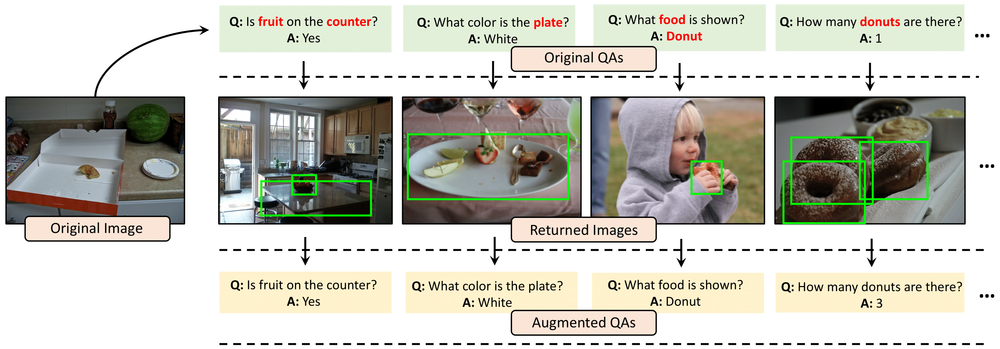

# SimpleAUG

Official implementation for the paper [Discovering the Unknown Knowns:
Turning Implicit Knowledge in the Dataset into Explicit Training Examples for Visual Question Answering](https://)   by Jihyung Kil, Cheng Zhang, Dong Xuan, Wei-Lun Chao, EMNLP 2021.

  

 

More updates will be avaialble soon.
